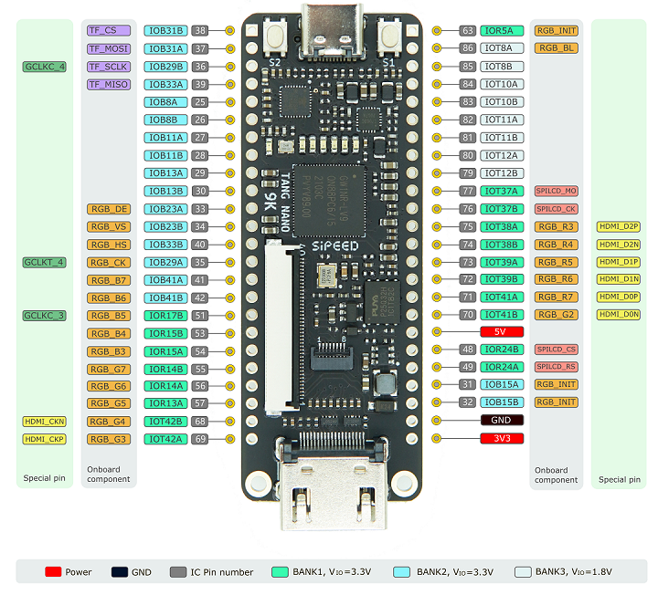

# VIC20Nano on Tang Nano 9K

VIC20Nano can be used in the [Tang Nano 9k](https://wiki.sipeed.com/hardware/en/tang/Tang-Nano-9K/Nano-9K.html).

The whole setup will look like this:<br>



**D9 retro Joystick Interface**

|Bus|Signal| D9  |TN9k pin| FPGA Signal    |
| - |------|-------------------|-|-------|
| 0 | Trigger | -    |27|  Trigger      |
| 1 | Down    | -    |28|  Down      |
| 2 | Up      | -    |25|  Up      |
| 3 | Right   | -    |26 | Right       |
| 4 | Left    | -    |29 | Left       |
| - | GND     | -    |GND |  GND      |

**Pinmap Dualshock 2 Controller Interface** <br>

| DS pin | TN9 pin | Signal | DS Function |
| ----------- | ---   | --------  | ----- |
| 1 | 54 | MISO | JOYDAT  |
| 2 | 53 | MOSI  | JOYCMD |
| 3 | n.c.  | - | 7V5 |
| 4 |  | GND | GND |
| 5 |  | 3V3 | 3V3 |
| 6 | 55 | CS | JOYATN|
| 7 | 51 | MCLK | JOYCLK |
| 8 | n.c.  | - | JOYIRQ |
| 9 | n.c.  | - | JOYACK |

**M0S Dock BL616 µC**

|Bus|M0S Signal|M0S Pin|TN9k pin | Signal  |
| - |------     |-------------------|-------------------|--------------------------------------|
| - | +5V       | +5V    |  5V       | 5V              |
| - | +3V3      | +3V3   |  n.c      | don't connect ! |
| - | GND       | GND    |  GND      | GND           |
| - | GND       | GND    |  GND      | GND           |
| 5 |  -        | -      |  41       | don't connect |
| 4 | IRQn      | GPIO14 |  35       | Interrupt from FPGA to MCU|
| 3 | SCK       | GPIO13 |  40       | SPI clock, idle low       |
| 2 | CSn       | GPIO12 |  34       | SPI select, active low    |
| 1 | MOSI      | GPIO11 |  33       | SPI data from MCU to FPGA |
| 0 | MISO      | GPIO10 |  30       | SPI data from FPGA to MCU |


On the software side the setup is very simuilar to the original Tang Nano 20K based solution. The core needs to be built specifically
for the different FPGA of the Tang Primer using either the [TCL script with the GoWin command line interface](build_tn9k.tcl) or the
[project file for the graphical GoWin IDE](vic20nano_tn9k.gprj). The resulting bitstream is flashed to the TN9K as usual.

> [!IMPORTANT]
For TN9K VIC20 **KERNAL** ROM and **BASIC** ROM have to be flashed:<br>

You will find VIC20 KERNAL and BASIC ROM's [here:](https://sourceforge.net/p/vice-emu/code/HEAD/tree/trunk/vice/data/VIC20/)<br>

Linux:<br>
```cat basic-901486-01.bin kernal.901486-07.bin basic-901486-01.bin kernal.901486-06.bin >32k.bin```<br>
```openFPGALoader --external-flash -o 0x000000 32k.bin```<br>
Windows:<br>
```COPY /B basic-901486-01.bin + kernal.901486-07.bin + basic-901486-01.bin + kernal.901486-06.bin 32k.bin```<br>

You might need to use an older version of the Gowin Programmer [SW](https://dl.sipeed.com/shareURL/TANG/programmer) for the GW1NR device.<br>
```programmer_cli -r 38 --mcuFile 32k.bin --spiaddr 0x000000 --cable-index 1 --d GW1NR-9C```

And also the firmware for the M0S Dock is the [same version as for
the Tang Nano 20K](https://github.com/harbaum/MiSTeryNano/tree/main/firmware/misterynano_fw/). 

# HW modification

Mandatory HW modification TN9K needed to fully support micro SD Card in 4bit data transfer mode.<br>
Rework place with Soldering Iron and a Microscope or magnifying glass needed.<br>
- **SD Card Data 1**<br>Wire SD card holder SD_dat1 pin 8 to TN9k FPGA pin 48. SPI LCD interface will be blocked by that.<br>
- **SD Card Data 2**<br>Wire SD card holder SD_dat2 pin 1 to TN9k FPGA pin 49. SPI LCD interface will be blocked by that.<br>

